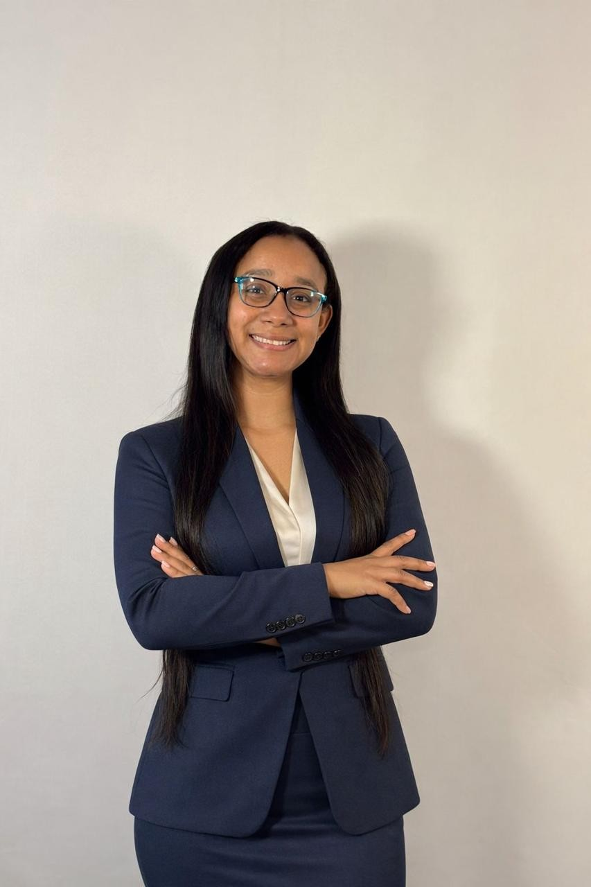

## Dheiry Lopez  - Software Engineer and Systems Analyst 

**Greetings!** I’m Dheiry López, a Software Engineer and Systems Analyst with 7+ years of experience delivering software solutions that improve processes, support operations, and create business value.

I have worked on enterprise systems, RESTful APIs, automation solutions, and application improvements across industries including energy, HR/payroll, healthcare manufacturing, and technology. My experience combines hands-on development with strong collaboration across teams, helping ensure that technical solutions are practical, scalable, and aligned with organizational goals.

## Skills and Expertise

My technical background includes **C#**, **.NET**, **ASP.NET**, **Angular**, **JavaScript**, **Node.js**, **SQL Server**, and **REST API development**. I also have experience with **RPA development using Automation Anywhere** and exposure to **AWS-based environments**.

In addition to software development, I have contributed to system migrations, process optimization initiatives, and cross-functional project execution, always with a focus on quality, maintainability, and delivery impact.

## Problem-Solving and Business Impact

I’m passionate about solving real business problems through technology. Whether it’s developing new features, improving system performance, automating repetitive tasks, or supporting a critical migration, I focus on creating solutions that are practical, scalable, and aligned with business goals.

I believe strong software is not only about writing code — it is also about understanding processes, user needs, and the bigger operational picture.

## How I Work

I enjoy turning complex requirements into structured, reliable solutions. I’m known for being adaptable, detail-oriented, and committed to clear communication. I work well with both technical and non-technical stakeholders, and I value teamwork as much as technical excellence.

## Collaboration and Communication

Throughout my career, I have worked closely with developers, business users, stakeholders, and cross-functional teams. I value clear communication, accountability, and collaboration, and I take pride in contributing to projects that require both technical depth and teamwork.

## Continuous Growth

Technology continues to evolve, and I’m committed to continuous learning and professional growth. I’m always looking for ways to strengthen my technical skills, expand my knowledge, and contribute more effectively to the teams and projects I support.

## Get in Touch

I’m open to remote opportunities, freelance collaborations, and professional connections in software engineering, systems analysis, and technical project delivery.

Feel free to explore my work and reach out if you’d like to connect.

_Let's build something amazing together!_
