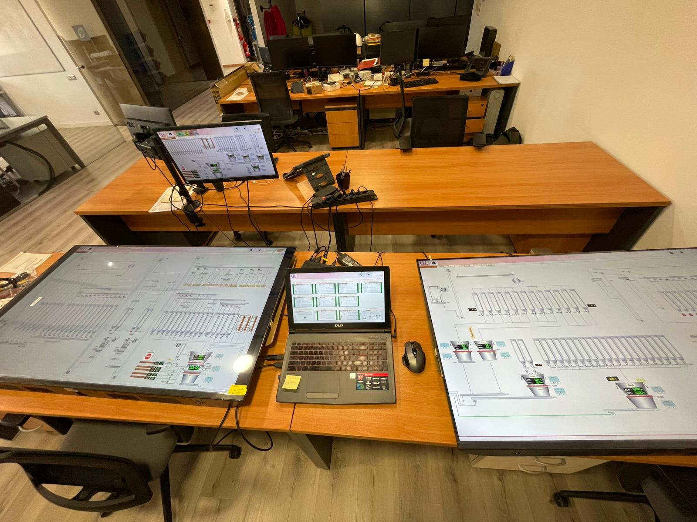

**Note:** Este caso de estudio muestra un proyecto real de automatización industrial desarrollado con Movicon, PLC, SQL y MES.

**Project Overview:**  
Sistema SCADA con Movicon para supervisión completa de una fábrica de pienso automatizada. Permite visualización en tiempo real, control de producción, gestión de alarmas, integración con MES y SQL, y optimización de procesos industriales críticos.

---

## 🎯 Objectives

1. Desarrollar un SCADA con múltiples sinópticos que permita **control total y supervisión clara** de la planta.  
2. Integrar SCADA con MES y SQL para **recibir datos críticos** de fórmulas, pesos, stock y alarmas.  
3. Mejorar la **eficiencia de la producción** mediante diagnósticos rápidos de errores y trazabilidad de datos.  
4. Diseñar una **interfaz HMI profesional**, con colores por estado, tendencias y alarmas visuales.  

---

## ⚡ Features

### 1. Visualización y Control de Planta
- Más de **10 sinópticos** por áreas (dosificación, molienda, stock, entradas, básculas, etc.)  
- **2 sinópticos 4K** con visión global de la fábrica  
- Supervisión de actuadores y sensores:  
  ⚙️ Motores, elevadores, raseras, distribuidores, piqueras, básculas y silos  

| Área | Funcionalidad |
|------|---------------|
| Entradas y dosificación | Supervisión de materia prima y flujo de ingredientes |
| Dosificación Básculas | Visualización de pesajes y fórmulas |
| Stock | Niveles de silos y materia prima |
| Molienda 1 y 2 | Control de granuladoras y raseras |
| Otros equipos | Distribuidores, piqueras, elevadores |

### 2. Gestión de Alarmas
- Fallos de marcha ⚡  
- Fallos de pesaje ⚖️  
- Fallos en lógica de rutas 🛤️  
- Nivel bajo de materia prima ⬇️  

| Prioridad | Color | Ejemplo |
|-----------|-------|---------|
| Alta | 🔴 Rojo | Motor detenido, fallo crítico |
| Media | 🟡 Amarillo | Pesaje fuera de rango |
| Baja | 🟢 Verde | Advertencia de nivel bajo de silo |

### 3. Integración con MES y SQL
- Recepción de datos críticos: fórmulas, pesos de lotes, stock de materia prima, alarmas  
- Centralización de información para **optimización de producción y trazabilidad**  

### 4. Interfaz HMI Profesional
- Colores y gráficos claros según estado  
- Tendencias de peso y producción en tiempo real 📈  
- Navegación intuitiva y fácil de usar para supervisores y operarios  

---

## 🛠️ Technology Stack

 
 
 
 
  

- **SCADA:** Movicon  
- **PLC:** Siemens / Allen-Bradley  
- **Database:** SQL Server  
- **MES Integration:** Programa MES propio de la planta  
- **Communication:** OPC UA  

---

## 📊 KPIs y Resultados

| KPI | Antes SCADA | Después SCADA | Mejora |
|-----|------------|---------------|--------|
| Errores de pesaje | 15/día | 2/día | 87% ↓ |
| Tiempo de diagnóstico de fallos | 45 min | 5 min | 89% ↓ |
| Tiempo de supervisión | Parcial | Total planta | 100% cobertura |
| Producción diaria | 5000 kg | 5400 kg | +8% |

**Beneficios:**
- Diagnóstico rápido de errores  
- Control centralizado de la planta  
- Integración con MES y SQL  
- Mayor eficiencia y trazabilidad de la producción  
- Interfaz profesional para supervisores  

---

## 🖼️ Evidencia Visual

### Sinópticos
<!--
-   
- 
-->
### Diagrama de Arquitectura
```text
           +-------------------+
           |       PLC         |
           +-------------------+
                 | OPC
                 v
           +-------------------+
           |  SCADA Movicon    |
           +-------------------+
            |            |
           v              v
      +--------+      +--------+
      |  SQL   |      |  MES   |
      +--------+      +--------+
